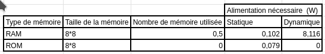

# Comparaison RAM et ROM

Voici dans ce dépôt l'ensemble des fichiers sources utilisé pour réaliser les blocs RAM et ROM.

## Etude

La différence entre ces deux blocs est simple : la RAM est une mémoire disponible en écriture et en lecture tandis que la ROM est seulement disponible en lecture. Il suffisait juste pour passer de l'une à l'autre de supprimer les entrées de données et d'adresse.

Comparaison entre RAM et ROM :

