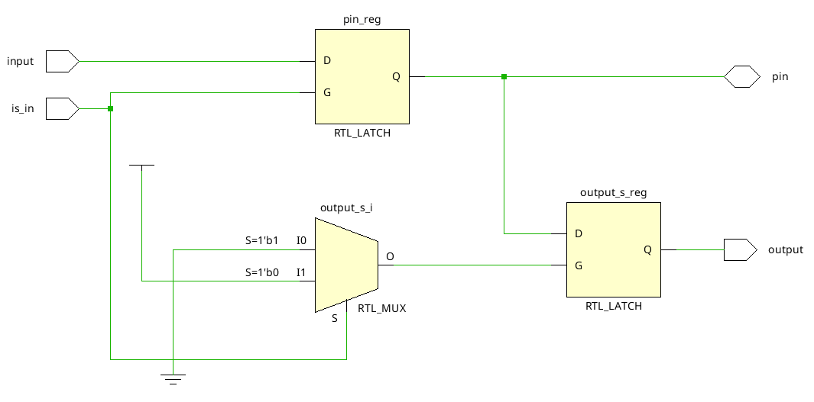
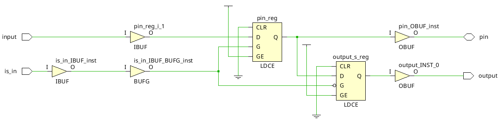

# Inout pin

Voici dans ce dépôt l'ensemble des fichiers sources utilisé pour réaliser les tests sur le pin inout.

## Etude

Le pin inout est paramétré à la fois en entrée et en sortie. Ici, j'ai implémenté une commande qui décide si le pin est en entrée ou en sortie. Cette méthode utilise 2 registres et 4 entrées/sorties.

Voici le code utilisé :
```vhdl
entity inout_pin is
    Port (
        pin: inout STD_LOGIC;
        input, is_in: in STD_LOGIC;
        output: out STD_LOGIC  );
end inout_pin;

architecture Behavioral of inout_pin is

signal output_s: STD_LOGIC;

begin

with is_in select pin <=
    input when '1',
    pin when '0';
    
with is_in select output_s <=
    output_s when '1',
    pin when '0';

output <= output_s;

end Behavioral;
```

Schematic de la synthèse :



Schematic de l'implémentation :


