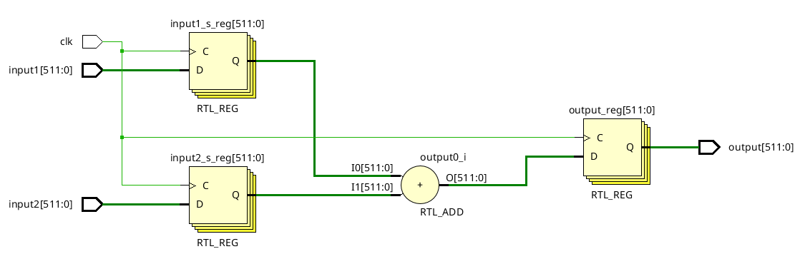

# Large adder

Voici dans ce dépôt l'ensemble des fichiers sources utilisé pour réaliser les tests sur l'additionneur non signé.

## Etude

Le code réalisé ici est très similaire à celui du multiplieur de l'exercice 1. On va devoir ici extraire le chemin le plus lent et le pipé pour l'amélioré en vitesse.

Voici le code utilisé :
```vhdl
entity generic_adder is
    Generic(nbit: integer := 512);
    Port(input1: in STD_LOGIC_VECTOR (nbit-1 downto 0);
        input2: in STD_LOGIC_VECTOR (nbit-1 downto 0);
        clk: in STD_LOGIC;
        output: out STD_LOGIC_VECTOR (nbit-1 downto 0));
end generic_adder;

architecture Behavioral of generic_adder is

signal input1_s, input2_s : unsigned (nbit-1 downto 0);

begin

process(clk)
begin
    if (clk'event and clk = '1') then
        input1_s <= unsigned(input1);
        input2_s <= unsigned(input2);
        output <= std_logic_vector(input1_s + input2_s);
    end if;
end process;
 
end Behavioral;
```

Schematic de la synthèse :



NB : je n'ai pas pu réaliser une étude sur le WNS en fonction du nombre de bits, ce dernier restant bloqué à 9.376 ns. Cependant, si j'avais pu, j'aurais trouvé le chemin le plus long, qui est sans dout celui contenant la retenue. 
