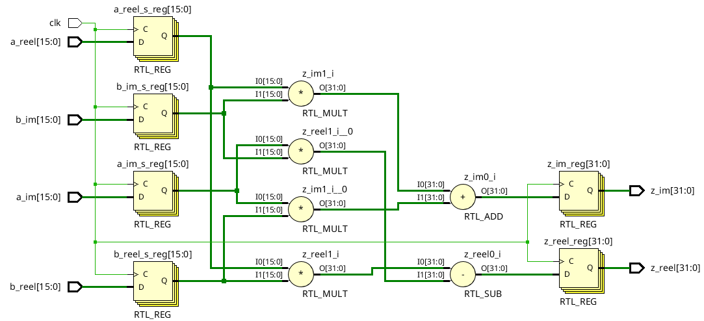
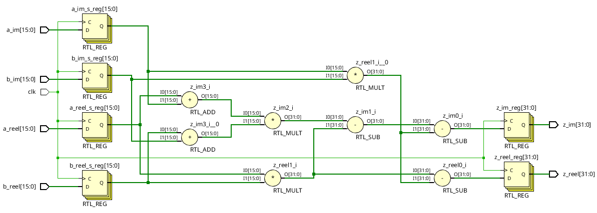
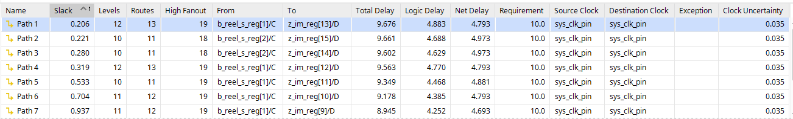
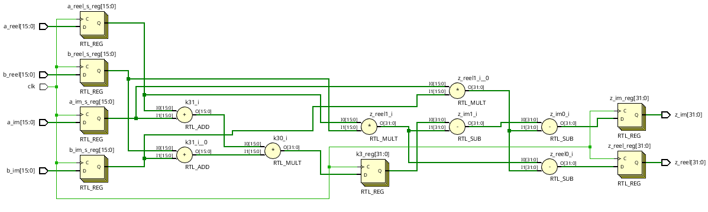
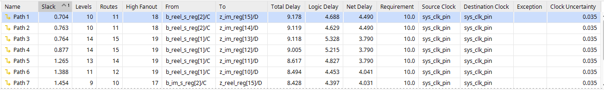
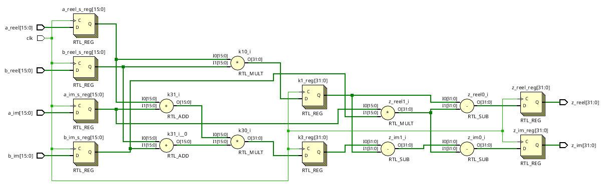
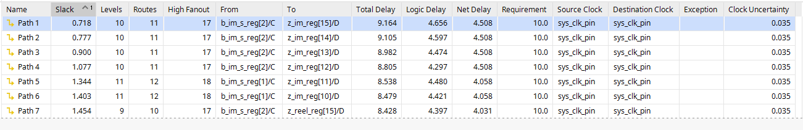
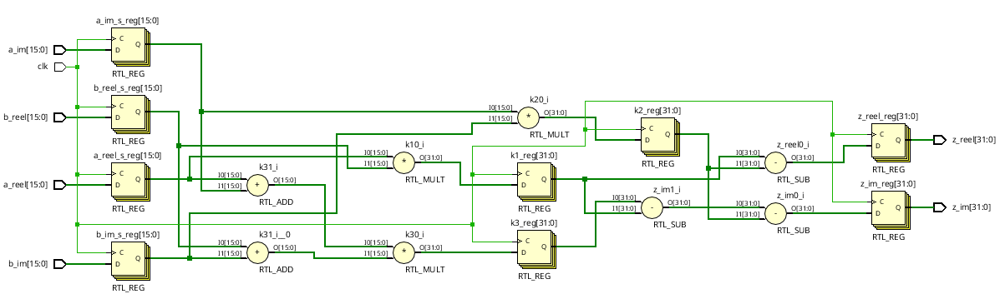
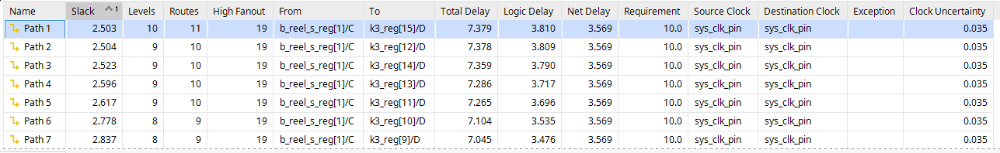
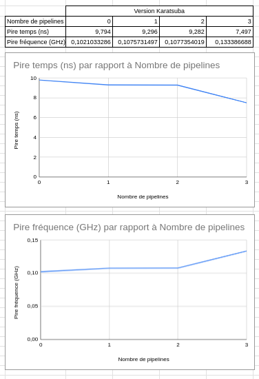

# Complex multiplier

Voici dans ce dépôt l'ensemble des fichiers sources utilisé pour réaliser les tests sur le multiplieur complexe.

## Etude

On a d'abord ici réalisé une version naive utilisant betement 4 multiplications en utilisant le code suivant :

```vhdl
entity naive_complex_multiplier is
    Generic(nbit : integer := 8);
    Port(a_reel : in STD_LOGIC_VECTOR(nbit-1 downto 0);
        a_im : in STD_LOGIC_VECTOR(nbit-1 downto 0);
        b_reel : in STD_LOGIC_VECTOR(nbit-1 downto 0);
        b_im : in STD_LOGIC_VECTOR(nbit-1 downto 0);
        clk : in STD_LOGIC;
        z_reel : out STD_LOGIC_VECTOR(2*nbit-1 downto 0);
        z_im : out STD_LOGIC_VECTOR(2*nbit-1 downto 0));
end naive_complex_multiplier;

architecture Behavioral of naive_complex_multiplier is

signal a_reel_s, a_im_s, b_reel_s, b_im_s : signed (nbit-1 downto 0);

begin

process (clk)
begin
    if (clk'event and clk = '1') then
        a_reel_s <= signed(a_reel);
        b_reel_s <= signed(b_reel);
        a_im_s <= signed(a_im);
        b_im_s <= signed(b_im);
        z_reel <= std_logic_vector((a_reel_s * b_reel_s) - (a_im_s * b_im_s));
        z_im <= std_logic_vector((a_reel_s * b_im_s) + (a_im_s * b_reel_s));
        end if;
    end process;

end Behavioral;
```

Schematic de la synthèse :



Une version plus rapide utilise l'algorithme de Karatsuba. Il permet l'utilisation de seulement 3 multiplications. Nous l'avons pipeliné 3 fois pour le rendre encore plus efficace. Voici le code réalisé :


```vhdl
entity karatsuba_complex_multiplier is
    Generic(nbit : integer := 16);
    Port(a_reel : in STD_LOGIC_VECTOR(nbit-1 downto 0);
        a_im : in STD_LOGIC_VECTOR(nbit-1 downto 0);
        b_reel : in STD_LOGIC_VECTOR(nbit-1 downto 0);
        b_im : in STD_LOGIC_VECTOR(nbit-1 downto 0);
        clk : in STD_LOGIC;
        z_reel : out STD_LOGIC_VECTOR(2*nbit-1 downto 0);
        z_im : out STD_LOGIC_VECTOR(2*nbit-1 downto 0));
end karatsuba_complex_multiplier;

architecture Behavioral of karatsuba_complex_multiplier is

signal a_reel_s, a_im_s, b_reel_s, b_im_s : signed (nbit-1 downto 0);
signal  k1, k2, k3 : signed (2*nbit-1 downto 0);

begin

--sans pipelines
process (clk)
begin
    if (clk'event and clk = '1') then
        a_reel_s <= signed(a_reel);
        b_reel_s <= signed(b_reel);
        a_im_s <= signed(a_im);
        b_im_s <= signed(b_im);
        z_reel <= std_logic_vector((a_reel_s * b_reel_s) - (a_im_s * b_im_s));
        z_im <= std_logic_vector((a_reel_s + a_im_s) * (b_reel_s + b_im_s) - (a_reel_s * b_reel_s) - (a_im_s * b_im_s));
        end if;
    end process;

----1 pipeline
--    process (clk)
--    begin
--        if (clk'event and clk = '1') then
--            a_reel_s <= signed(a_reel);
--            b_reel_s <= signed(b_reel);
--            a_im_s <= signed(a_im);
--            b_im_s <= signed(b_im);
--            k3 <= (a_reel_s + a_im_s) * (b_reel_s + b_im_s);
--            z_reel <= std_logic_vector((a_reel_s * b_reel_s) - (a_im_s * b_im_s));
--            z_im <= std_logic_vector(k3 - (a_reel_s * b_reel_s) - (a_im_s * b_im_s));
--            end if;
--        end process;

----2 pipelines
--process (clk)
--begin
--    if (clk'event and clk = '1') then
--        a_reel_s <= signed(a_reel);
--        b_reel_s <= signed(b_reel);
--        a_im_s <= signed(a_im);
--        b_im_s <= signed(b_im);
--        k1 <= a_reel_s * b_reel_s;
--        k3 <= (a_reel_s + a_im_s) * (b_reel_s + b_im_s);
--        z_reel <= std_logic_vector(k1 - (a_im_s * b_im_s));
--        z_im <= std_logic_vector(k3 - k1 - (a_im_s * b_im_s));
--        end if;
--    end process;

----3 pipelines
--process (clk)
--begin
--    if (clk'event and clk = '1') then
--        a_reel_s <= signed(a_reel);
--        b_reel_s <= signed(b_reel);
--        a_im_s <= signed(a_im);
--        b_im_s <= signed(b_im);
--        k1 <= a_reel_s * b_reel_s;
--        k2 <= a_im_s * b_im_s;
--        k3 <= (a_reel_s + a_im_s) * (b_reel_s + b_im_s);
--        z_reel <= std_logic_vector(k1 - k2);
--        z_im <= std_logic_vector(k3 - k1 - k2);
--        end if;
--    end process;

end Behavioral;
```

Voici dans les 4 cas le schéma de la synthèse et le temps restant après les pires parcours :

Sans pipeline :





1 pipeline :





2 pipelines :





3 pipelines :





En résumé, voici un comparatif sur le pire temps et la pire fréquence dans les 4 cas :


